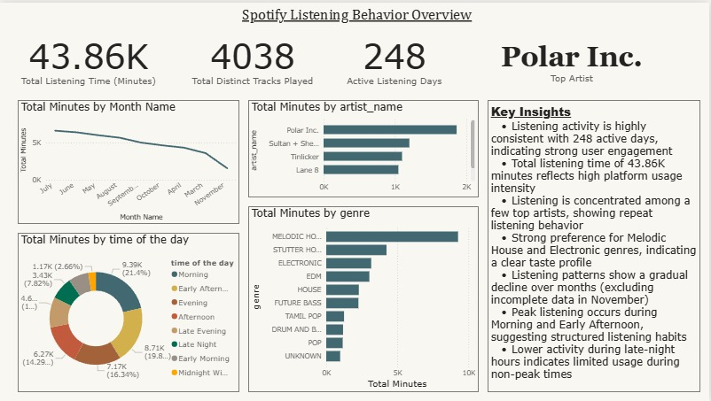
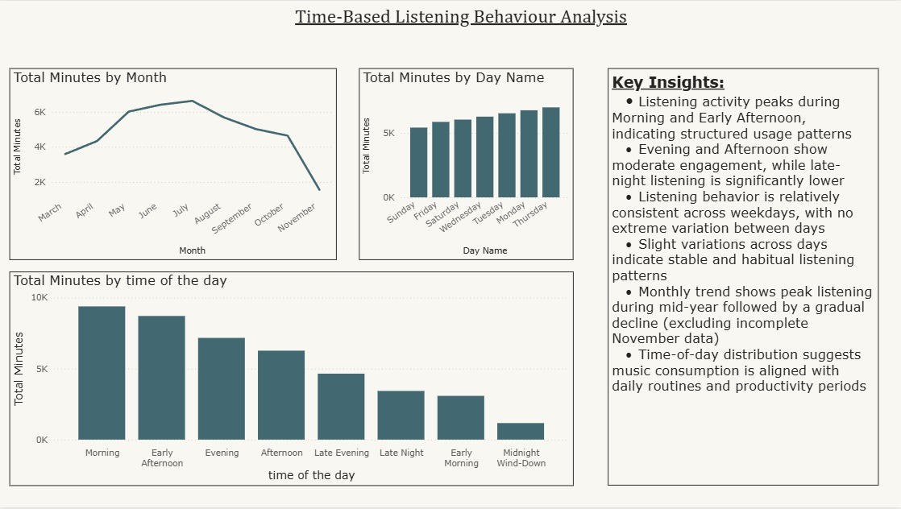
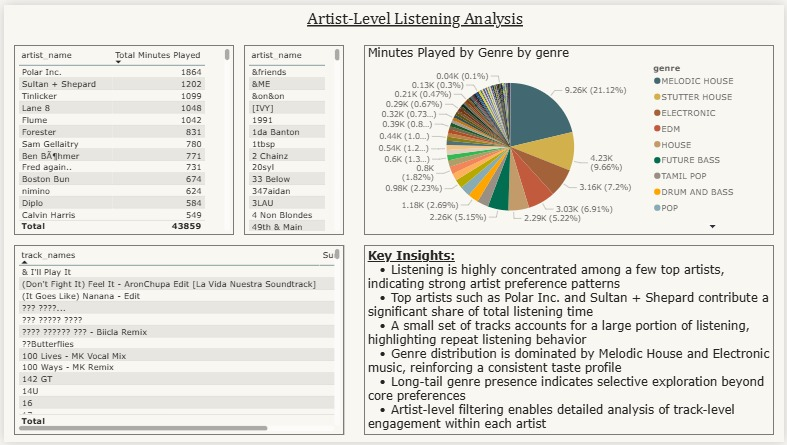
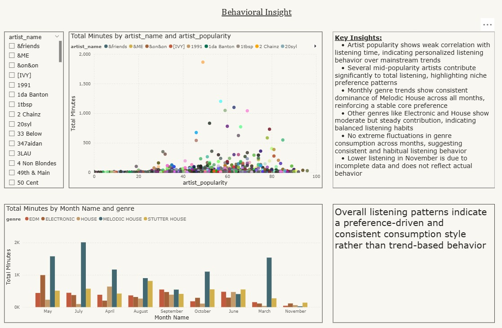
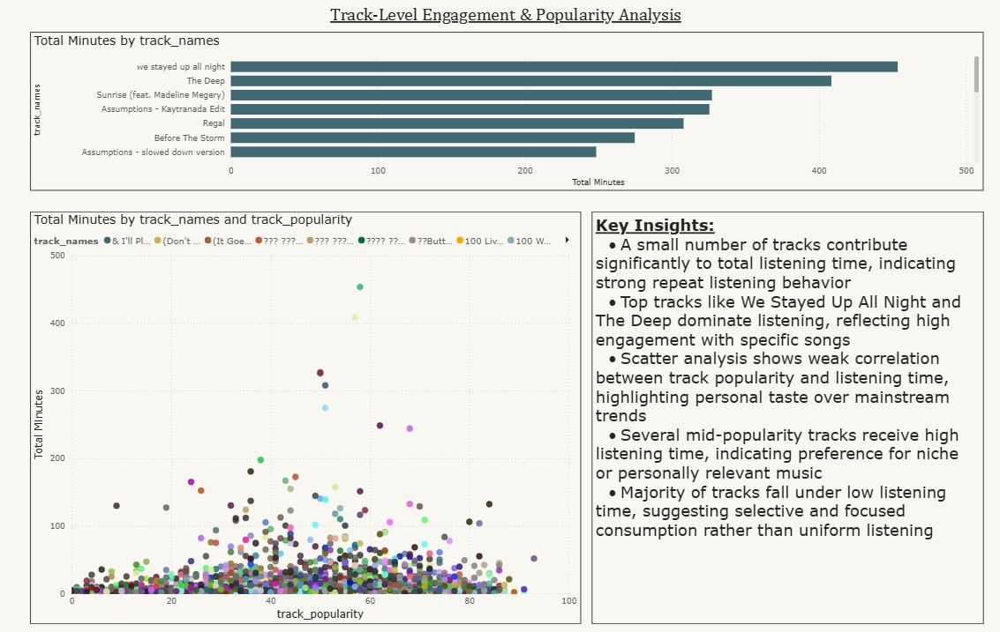
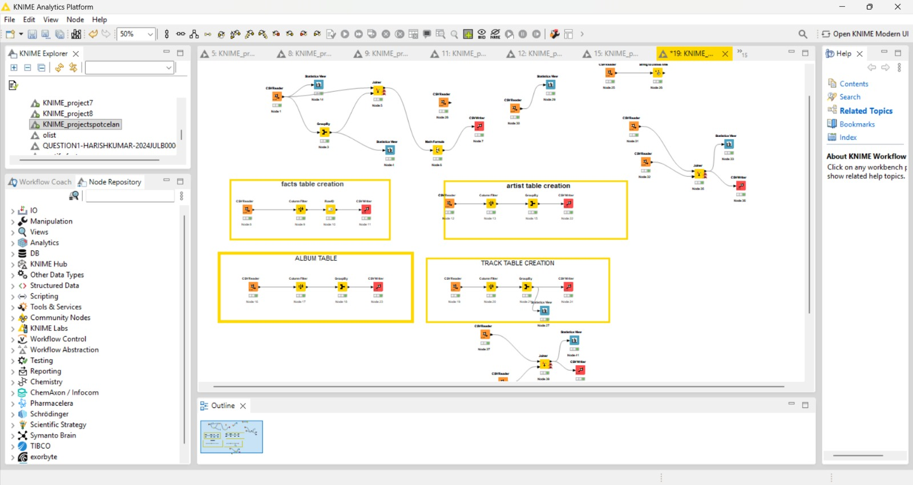

🎧 Spotify Listening Behavior Analysis

📌 Business Problem

Understanding user listening behavior to improve engagement, retention, and recommendation systems.

⸻

🎯 Objective

Analyze listening patterns across time, artists, and tracks to uncover behavioral insights.

⸻

🛠️ Tools Used
	•	Power BI
	•	KNIME
	•	Power Query
	•	Excel

⸻

📸 Interactive Dashboard Insights

⸻

⚙️ Data Pipeline (KNIME)

⸻

📊 Key Insights
	•	Listening is concentrated among a few artists → repeat behavior
	•	Personal taste dominates over popularity
	•	Peak listening during morning & early afternoon
	•	Strong genre preference consistency
	•	Few tracks contribute heavily to total listening time

⸻

📦 Data Availability

Dataset not uploaded due to size and personalization.
Available upon request.

⸻

🚀 Next Steps
	•	SQL integration
	•	Recommendation system
	•	User segmentation
