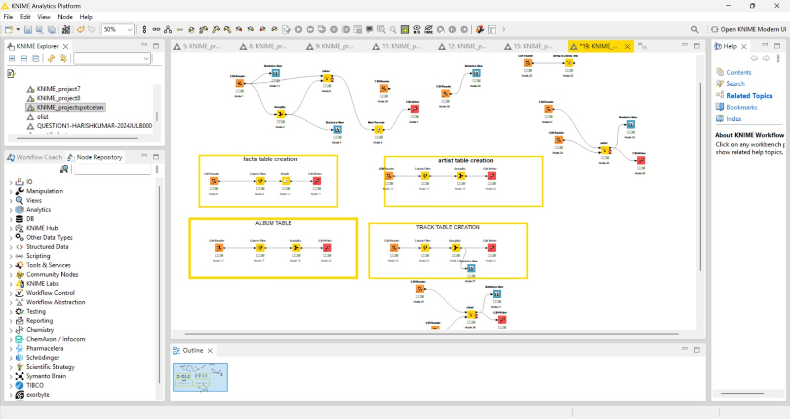
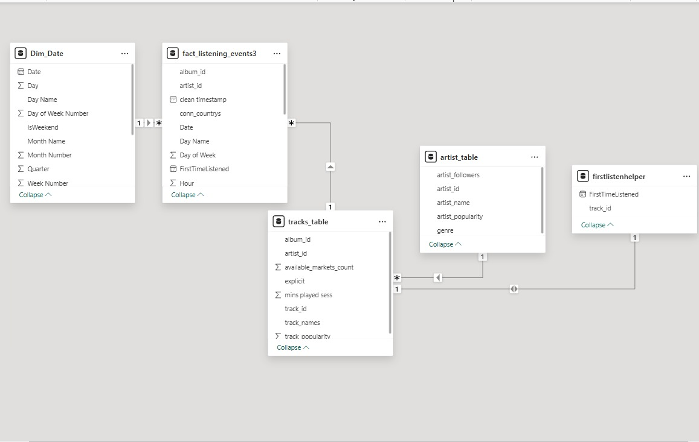
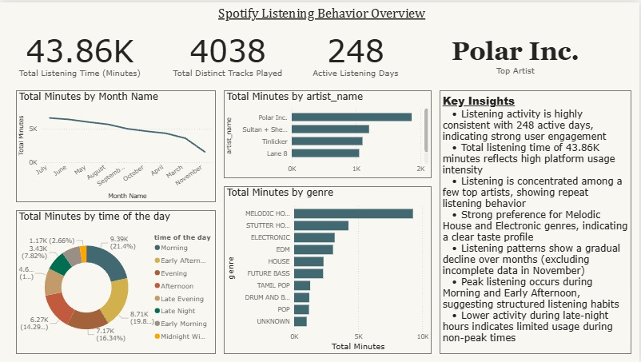
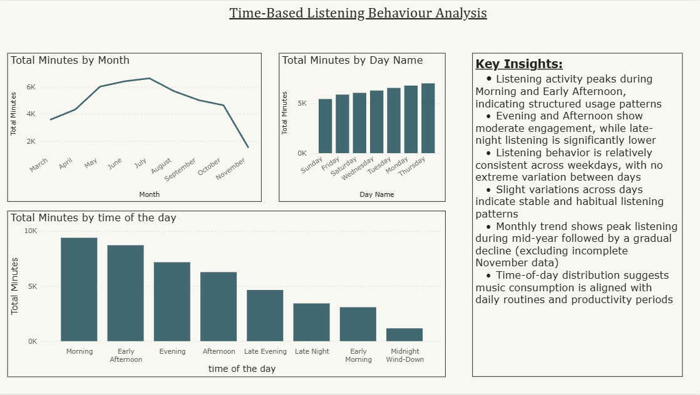
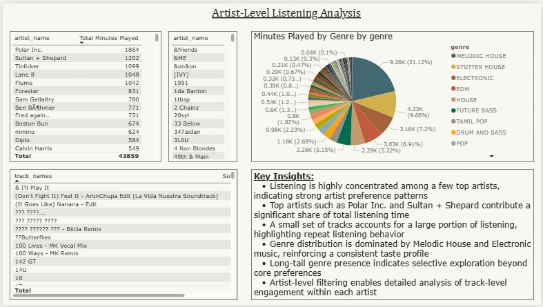
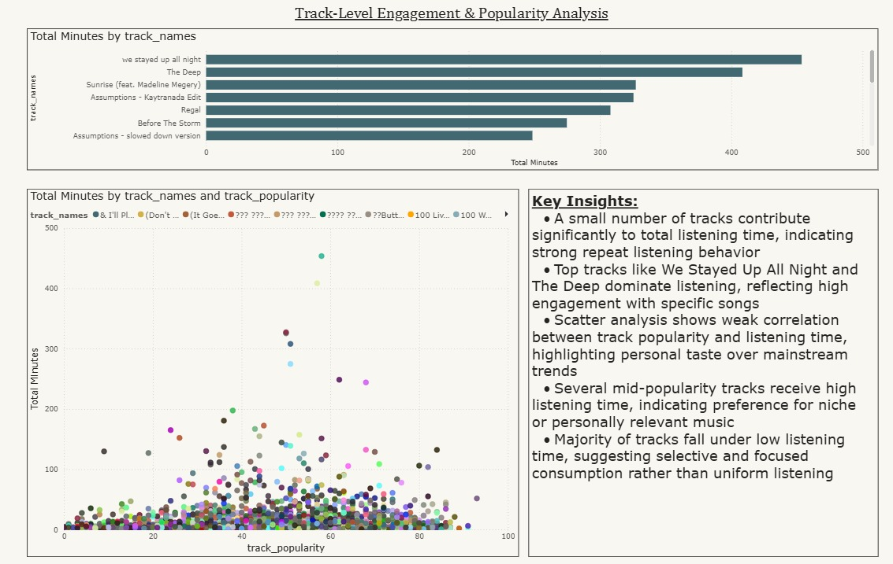
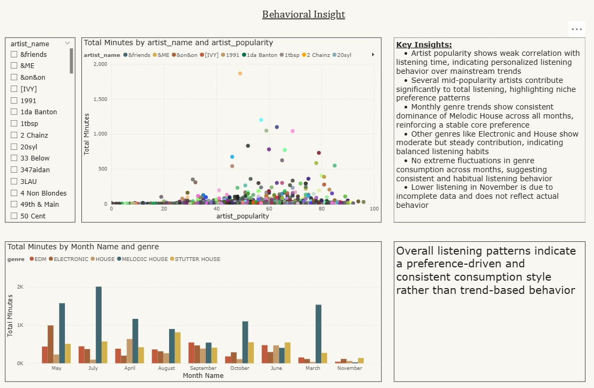

# 🎧 Spotify Listening Behavior Analysis

> **A data analytics project that turns Spotify listening history into behavioral insights, identifies engagement patterns, and translates those patterns into practical business opportunities for personalization and user engagement.**

[](#) [](#) [](#) [](#)

---

## 🚀 Project at a Glance

### Business Question

**What actually drives listening behavior — popularity, personal taste, time of day, or repeat consumption?**

This project analyzes a personal Spotify listening dataset to understand **when, what, and how users listen**, then converts those observations into business use cases for a music-streaming platform.

### What I analyzed

- ⏱️ Listening time and temporal patterns
- 🎵 Artist and track concentration
- 🎯 Repeat listening and content affinity
- 📈 Popularity vs. actual consumption
- 🎼 Genre preferences
- 📅 Daily, weekly, and monthly behavior
- 👤 Potential signals for personalization and engagement

---

## 📊 Executive Summary

| Metric / Finding | Insight |
|---|---|
| **43.86K** | Total minutes listened |
| **4,038** | Unique tracks |
| **248** | Active listening days |
| **Top artists** | Listening is concentrated among a smaller set of artists |
| **Peak period** | Morning & early afternoon |
| **Late night** | Comparatively lower activity |
| **Popularity vs. consumption** | Weak relationship in this dataset |
| **Behavior pattern** | Repeat consumption + personal taste are prominent signals |

### The core takeaway

> **Listening behavior in this dataset is preference-driven, repeat-focused, and strongly shaped by routine rather than being explained primarily by mainstream popularity.**

---

## 🔎 Why This Matters to a Business

A streaming platform does not only need to know **what users played**.

It needs to understand:

**What → When → How often → What they return to → What can be personalized**

That creates opportunities to improve:

- 🎯 Recommendation relevance
- 🔁 Repeat engagement
- 🔔 Notification timing
- 🎼 Content discovery
- 👤 Personalized experiences
- 📊 Audience and content targeting

---

## 🧠 Analytical Workflow

**Spotify Listening Data**  
↓  
**KNIME — Cleaning & Feature Engineering**  
↓  
**Power Query — Transformation**  
↓  
**Power BI — Data Model & Dashboard**  
↓  
**Behavioral Analysis**  
↓  
**Business Insights & Opportunity Signals**

---

## 🛠️ Tech Stack

| Tool | Role |
|---|---|
| **Power BI** | Dashboarding, modeling, KPIs and behavioral analysis |
| **KNIME** | Data ingestion, preprocessing and feature engineering |
| **Power Query** | Data transformation and shaping |
| **Excel / CSV** | Raw data handling |
| **Star-schema style model** | Separating listening events from artist, track and time dimensions |

---

# ⚙️ End-to-End Data Pipeline

## 1. Data Collection

The analysis uses a **personal Spotify listening dataset** containing fields such as:

- `artist_name`
- `track_name`
- `genre`
- `minutes_played`
- `timestamp`

The raw data was prepared for downstream behavioral analysis.

---

## 2. Data Processing with KNIME

The KNIME workflow handles the main preparation layer:

- Data ingestion from CSV / JSON
- Cleaning and filtering
- Data structuring
- Time-based feature extraction
- Genre mapping
- Creation of analytical tables

### Output

A structured dataset ready for BI modeling and behavioral analysis.



---

## 3. Data Modeling in Power BI

A **star-schema style model** was created to separate analytical concerns:

- **Fact table** → listening events
- **Artist table** → artist-level attributes
- **Track table** → track-level attributes
- **Time dimension** → date and temporal analysis



This structure makes it easier to analyze listening behavior across multiple dimensions without relying on one flat table.

---

# 📈 Dashboard Analysis

## 01 — Overview

The overview establishes the scale and concentration of listening.

**43.86K minutes | 4,038 unique tracks | 248 active days**



### Business interpretation

A relatively large listening history can still be concentrated around a smaller set of artists and tracks. That makes **repeat affinity** an important signal for personalization.

---

## 02 — Time-Based Behavior



### Findings

- Listening peaks during **morning and early afternoon**
- Late-night activity is comparatively lower
- Weekday behavior is relatively stable
- Listening rises around the middle of the year before gradually declining

### Business opportunity

**Use habitual listening windows as a personalization signal.**

Potential applications include:

- Context-aware recommendation surfaces
- Timing of personalized notifications
- Time-sensitive playlist suggestions
- Session-based content discovery

> These are potential applications inferred from the observed behavioral patterns, not measured causal effects.

---

## 03 — Artist-Level Behavior



### Findings

- Listening is concentrated among a smaller group of artists
- Repeat behavior is strong
- A long tail of artist exploration still exists

### Business opportunity

This suggests a balance between:

**Known affinity → discovery**

A recommendation strategy could use strong artist affinity as an anchor while introducing controlled discovery around adjacent content.

---

## 04 — Track-Level Consumption



### Findings

- A smaller group of tracks contributes a substantial share of listening
- Repeat consumption is visible across specific tracks

### Business opportunity

Track-level repeat behavior can serve as a potential **engagement and preference signal**.

Possible applications:

- Personalized mixes
- Repeat-friendly playlists
- Similar-track recommendations
- Re-engagement surfaces around previously enjoyed content

---

## 05 — Popularity vs. Actual Consumption



### Finding

The relationship between track popularity and listening time is **not strong in this dataset**.

Some mid-popularity tracks perform strongly in actual consumption.

### Business interpretation

This indicates that **platform-wide popularity alone may not fully represent individual listening preference** in this dataset.

### Business opportunity

Recommendation logic can incorporate **user-level behavior and repeat affinity**, rather than relying only on global popularity signals.

---

# 🔥 Key Behavioral Insights

### 01 — Repeat Behavior Dominates

A smaller group of artists and tracks accounts for a meaningful share of listening.

**Signal:** repeat affinity.

---

### 02 — Personal Taste Matters

Actual consumption does not strongly track with popularity in this dataset.

**Signal:** user-specific preference can differ from mainstream demand.

---

### 03 — Listening Is Routine-Driven

Morning and early-afternoon activity is stronger, while late-night activity is comparatively lower.

**Signal:** time/context can complement content preference.

---

### 04 — Genre Preference Is Concentrated

Genres such as **Melodic House and Electronic** show strong representation in the listening history.

**Signal:** genre affinity can support content discovery.

---

### 05 — Behavior Is Relatively Consistent

Listening patterns remain fairly stable across days and months, with identifiable changes over longer periods.

**Signal:** recurring behavior can support personalized experiences.

---

# 💼 From Insight → Business Solution

| Observed Pattern | Analytical Signal | Potential Business Solution |
|---|---|---|
| Strong repeat listening | Track / artist affinity | Personalized recommendations |
| Morning & afternoon peaks | Time-of-day preference | Context-aware content and notification timing |
| Popularity not strongly aligned with consumption | User-specific taste | Reduce dependence on popularity-only recommendations |
| Concentrated artist behavior | Artist affinity | Similar-artist discovery and personalized mixes |
| Strong genre representation | Genre preference | Genre-aware discovery |
| Stable listening routines | Recurring behavior | Habit-based engagement experiences |

> **The business solution is not simply “build a dashboard.” The dashboard identifies behavioral signals that can be translated into personalization, discovery, and engagement opportunities.**

---

# 📁 Repository Structure

```text
spotify-listening-behavior-analysis/
│
├── README.md
│
├── knime/
│   ├── workflow.knwf
│   └── screenshot/
│       └── knime.png
│
└── powerbi/
    ├── dashboard.pbix
    └── screenshots/
        ├── overview.png
        ├── time.png
        ├── artist.png
        ├── track.png
        ├── behavior.png
        └── schema.png
```

---

# 📦 Data Availability

The underlying dataset is personal and is **not publicly uploaded**.

A sample or representative dataset can be shared upon request.

---

# 🚀 Future Enhancements

- SQL-based analytical layer
- Rule-based recommendation prototype
- More advanced user segmentation
- Session-level analysis
- Automated KPI reporting
- Recommendation evaluation using historical listening behavior

---

# 🎯 What This Project Demonstrates

### Data Analytics
Turning raw listening events into interpretable behavioral patterns.

### Data Preparation
Building a repeatable preprocessing workflow with KNIME and Power Query.

### BI & Visualization
Designing Power BI views around business questions rather than only displaying metrics.

### Data Modeling
Using a star-schema style structure for multi-dimensional analysis.

### Business Thinking
Connecting observed behavior to potential personalization, discovery, and engagement solutions.

---

# 🏁 Final Takeaway

**Raw Listening Data → Clean & Structured Data → Data Model → Behavioral Analysis → Business Signals → Potential Personalization & Engagement Solutions**

This project demonstrates how a data analyst can move beyond **“what happened?”** to ask:

> **“What does the behavior tell us, and how could a business use that signal?”**

---

### 👤 Project by Harish Kumar R
**Data Analytics | SQL | Power BI | KNIME | Excel**

